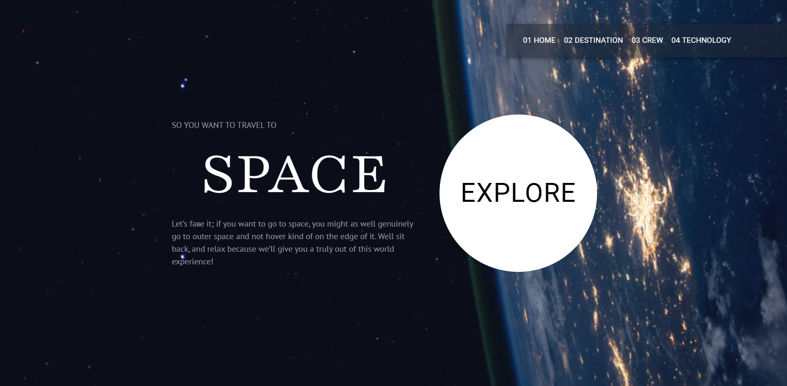

# Frontend Mentor - Space tourism website solution

This is a solution to the [Space tourism website challenge on Frontend Mentor](https://www.frontendmentor.io/challenges/space-tourism-multipage-website-gRWj1URZ3). Frontend Mentor challenges help you improve your coding skills by building realistic projects. 

## Table of contents

- [Overview](#overview)
  - [The challenge](#the-challenge)
  - [Screenshot](#screenshot)
  - [Links](#links)
- [My process](#my-process)
  - [Built with](#built-with)
  - [What I learned](#what-i-learned)
  - [Continued development](#continued-development)
  - [Useful resources](#useful-resources)
- [Author](#author)
- [Acknowledgments](#acknowledgments)


## Overview

### The challenge

Users should be able to:

- View the optimal layout for each of the website's pages depending on their device's screen size
- See hover states for all interactive elements on the page
- View each page and be able to toggle between the tabs to see new information

### Screenshot



Add a screenshot of your solution. The easiest way to do this is to use Firefox to view your project, right-click the page and select "Take a Screenshot". You can choose either a full-height screenshot or a cropped one based on how long the page is. If it's very long, it might be best to crop it.

Alternatively, you can use a tool like [FireShot](https://getfireshot.com/) to take the screenshot. FireShot has a free option, so you don't need to purchase it. 

Then crop/optimize/edit your image however you like, add it to your project, and update the file path in the image above.


### Links

- Solution URL: [Add solution URL here](https://www.frontendmentor.io/solutions/create-page-by-mui-3Ehoiwq5Uz)
- Live Site URL: [Add live site URL here](https://master--admirable-halva-09f882.netlify.app/)

## My process

1.(1hr) Build Up `Main Page` and create `step` which is controled by `navbar` component to manipulate multiple page:

- Home
- Destination
- Crew
- Technology

Then, use `switch` to return different page, while clicking the `navbar`

2.(1hr) Retrive data from ./starter-code/data.json. Get all data needed in the element, for example in `Destination.jsx`:

```
    const [plant, setplant] = useState(0)

    const name = data["destinations"][plant]["name"]
    const description = data["destinations"][plant]["description"]
    const distance = data["destinations"][plant]["distance"]
    const travel = data["destinations"][plant]["travel"]

```

While the `plant` is changed `setplant` would set up a new value while click the `navbar`

3.(1hr) use `DotsMobileStepper` and `GroupOrientation` from mui as `navbar` to control the info of the page we've mentioned before.

* noted: however I still try to change color of the Dot color in `DotsMobileStepper`

4.(1hr) Finished css and html design. 

### Built with

- Semantic HTML5 markup
- CSS custom properties
- Flexbox
- CSS Grid
- Mobile-first workflow
- [React](https://reactjs.org/) - JS library
- [Next.js](https://nextjs.org/) - React framework
- [Material-ui](https://mui.com/)


### What I learned

#### How's my adventage while develop this project?

- Image all the page road map at the begining. 
- Learn to use `useState` and `switch` to control the page
- Learn to retrive data from json file

#### How can I be better?

- I can learn to customized mui component by [`palette`](https://mui.com/material-ui/customization/palette/) or `theme` for example
- control position by rule in mui

### Continued development

It would be great to build up a personal website


### Useful resources

- [react-stepper](https://mui.com/material-ui/react-stepper/) - This help me to design the stepper
- [react- app nav](https://mui.com/material-ui/react-app-bar/) - This help me to design the stepper


## Author

- Website - [Chious](https://github.com/Chious)
- Frontend Mentor - [@Chious](https://www.frontendmentor.io/profile/Chious)
- Twitter - [@Chious](https://twitter.com/ChiouJiaSheng)


## Acknowledgments

nope
